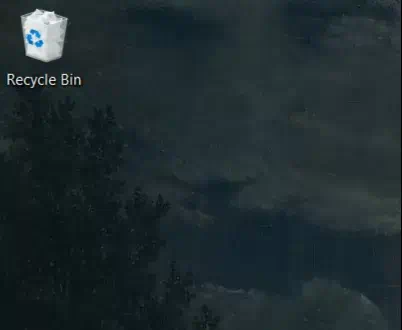

# MetroOsd

MetroOsd is a lightweight, metro-style on-screen display (OSD) for Windows 10. 

It hooks specifical events globally and shows a indicator, positioned relative to Windows' native OSD.

## Requirements

- Windows 10
- [.NET 8 Desktop Runtime](https://dotnet.microsoft.com/download/dotnet/8.0) — if you prefer non-SelfContained builds

## Usage

Download from the [Releases](https://github.com/proxyerium/MetroOsd/releases):

- `MetroOsd-<tag>-selfcontained.zip` — standalone `osd.exe`, no runtime needed.
- `MetroOsd-<tag>-framework-dependent.zip` — smaller `osd.exe`, requires the .NET 8 Desktop Runtime.

Extract the archive and run `osd.exe`, run `install.ps1` if you want MetroOsd autostarted when startup.

## Credits

- **[Microsoft.Windows.CsWin32](https://github.com/microsoft/CsWin32)** — source-generated Win32 P/Invoke bindings used for all native calls.
- **.NET / Windows Forms** — application framework ([.NET](https://dotnet.microsoft.com)).
- **Segoe MDL2 Assets** — icon glyphs used for indicators (Microsoft).

## License

[MIT](LICENSE.txt)
